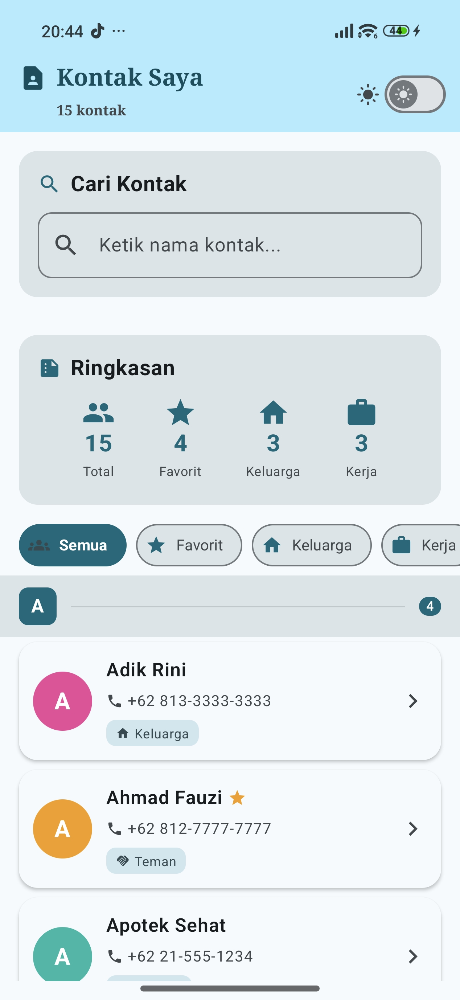
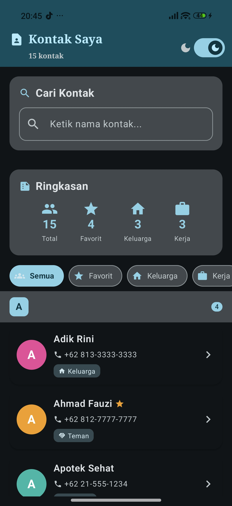
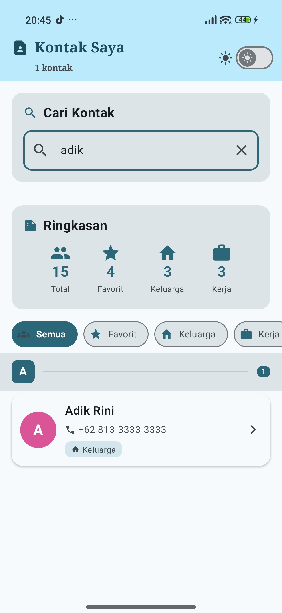
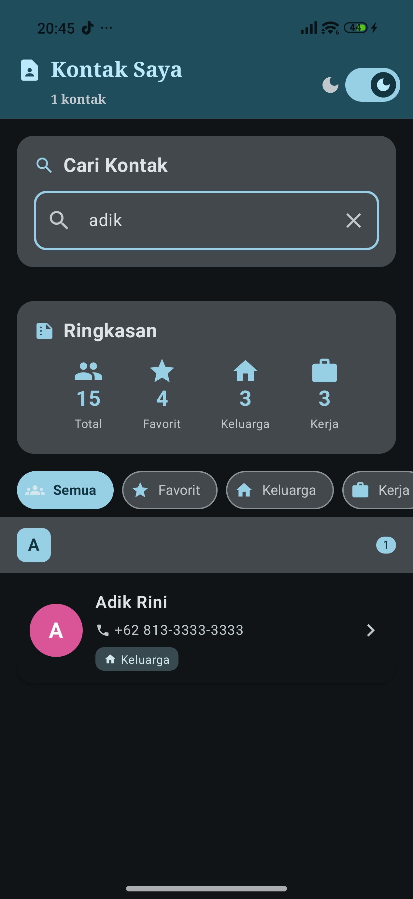
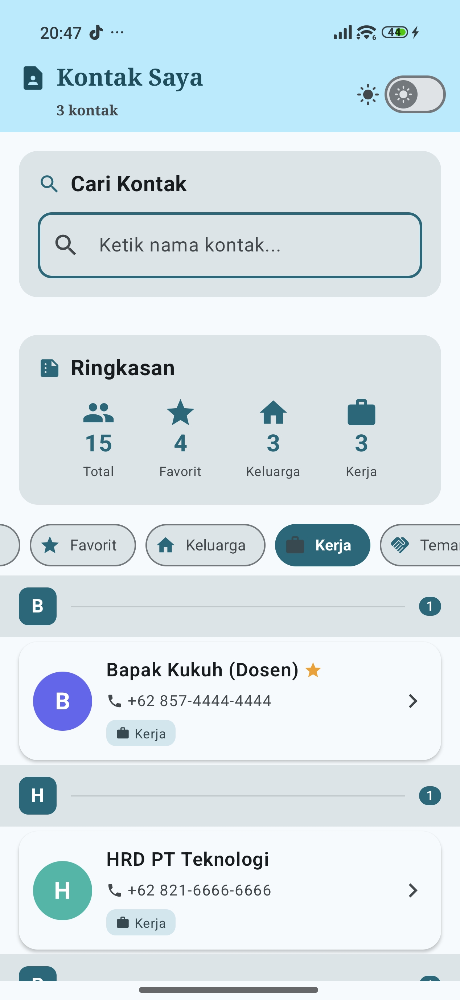
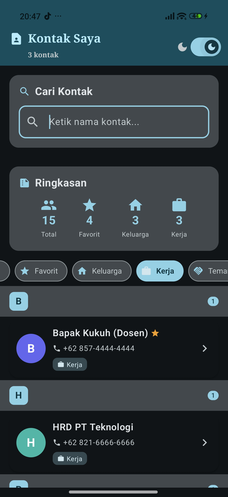
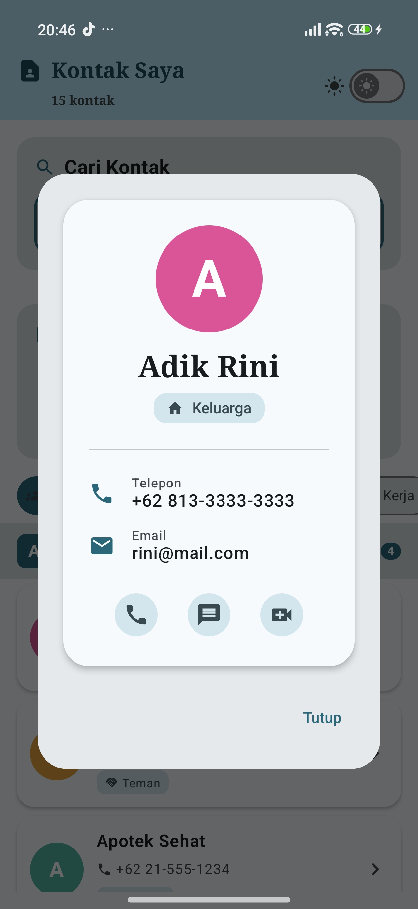
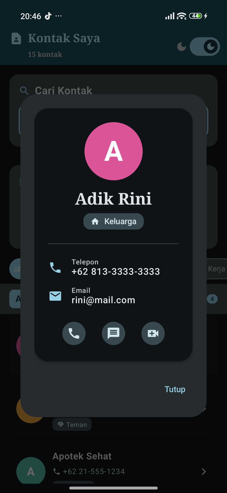

# 📱 Aplikasi Kontak - Jetpack Compose Lanjutan

[](https://developer.android.com/studio)
[](https://kotlinlang.org/)
[](https://developer.android.com/jetpack/compose)

Proyek ini adalah aplikasi daftar kontak modern yang dibangun menggunakan **Jetpack Compose**. Aplikasi ini mendemonstrasikan implementasi daftar yang efisien, desain komponen yang dapat digunakan kembali, serta penerapan Material Design 3 (Material3) dengan dukungan mode gelap (Dark Mode).

---

## 👤 Identitas Mahasiswa

- **Nama**: Willy Rafael F. Silalahi
- **NIM**: 23083000168
- **Kelas**: 6A2
- **Mata Kuliah**: Pemrograman Mobile
- **Instansi**: Universitas Merdeka Malang


---

## 📝 Deskripsi Proyek

Aplikasi Kontak ini dikembangkan sebagai bagian dari praktikum Week 4 - Jetpack Compose Lanjutan. Fokus utama dari proyek ini adalah bagaimana mengelola daftar data yang besar secara efisien menggunakan `LazyColumn` dan `LazyRow`, serta bagaimana membangun UI yang fleksibel menggunakan *Slot API* dan *Custom Composables*.

### Fitur Utama & Tugas Mandiri:
- ✅ **Optimasi Daftar**: Menggunakan `LazyColumn` dengan `stickyHeader` untuk pengelompokan kontak berdasarkan inisial (A-Z).
- ✅ **Filter Kategori**: Menggunakan `LazyRow` dengan `FilterChip` untuk menyaring kontak (Semua, Favorit, Keluarga, Kerja, dll).
- ✅ **Fitur Pencarian**: Pencarian kontak secara *real-time* berdasarkan nama menggunakan `TextField`.
- ✅ **Detail Kontak**: Dialog informasi lengkap kontak menggunakan *Custom Composable* `ContactDetail`.
- ✅ **Animasi Item**: Transisi halus saat daftar difilter atau dicari menggunakan `.animateItem()`.
- ✅ **Material3 Theming**: Implementasi skema warna dinamis dan dukungan penuh untuk **Light/Dark Mode** yang bisa di-toggle secara manual.
- ✅ **Custom Typography**: Penggunaan font yang berbeda antara *Heading* (Serif) dan *Body* (Sans-Serif) untuk tipografi yang lebih profesional.

---

## 📸 Screenshots

| Fitur | Light Mode | Dark Mode |
|:---:|:---:|:---:|
| **Tampilan Utama**<br>*Daftar kontak utama dengan<br>Sticky Header (A-Z) dan<br>filter kategori.* |  |  |
| **Fitur Pencarian**<br>*Pencarian real-time yang<br>menyaring daftar secara<br>otomatis.* |  |  |
| **Filter Kategori**<br>*Menyaring kontak berdasarkan<br>label (Favorit, Keluarga,<br>Kerja, dll).* |  |  |
| **Detail Kontak**<br>*Dialog informasi lengkap<br>menggunakan Custom<br>Composable.* |  |  |

---

## 🔑 Konsep Kunci (Materi Praktikum)

### 1. LazyColumn vs Column
`LazyColumn` hanya me-render item yang terlihat di layar, sangat efisien untuk daftar panjang (1000+ item), berbeda dengan `Column` biasa yang me-render semua item sekaligus.

### 2. Slot API
Memungkinkan pembuatan komponen yang fleksibel dengan menerima `@Composable` lambda sebagai parameter (seperti "bingkai" yang isinya bisa ditentukan kemudian).

### 3. Material3 Color Roles
- **Primary**: Warna utama (tombol, link).
- **Surface**: Background untuk card dan dialog.
- **On-Colors**: Warna teks yang kontras di atas background tertentu (misal: `onPrimary` di atas `primary`).

---

## 📁 Struktur Project

```
Week4_AplikasiKontak/
├── app/src/main/java/com/example/aplikasikontak/
│   ├── MainActivity.kt              ← Entry point & Tema State
│   ├── data/
│   │   └── Contact.kt              ← Model data, Enum & Data Dummy
│   ├── components/                  ← CUSTOM COMPOSABLE
│   │   ├── CategoryChip.kt         ← Chip filter dengan icon
│   │   ├── ContactCard.kt          ← Card list kontak
│   │   ├── ContactDetail.kt        ← Card detail informasi (Tugas)
│   │   └── SectionHeader.kt        ← Sticky header & Section Card (Slot API)
│   ├── screens/
│   │   └── ContactListScreen.kt    ← LAYAR UTAMA (Logic Search & List)
│   └── ui/theme/
│       ├── Theme.kt                ← Konfigurasi Material3
│       └── Type.kt                 ← Custom Typography (Tugas)
├── app/build.gradle.kts            ← Dependencies (Icons Extended, dll)
└── README.md
```

---

## 🚀 Cara Menjalankan

1. **Clone Repository**:
   ```bash
   git clone https://github.com/willyrafaelfs/Pemrograman-Mobile-Aplikasi-Kontak.git
   ```
2. **Buka di Android Studio**: Pilih folder `Week4_AplikasiKontak`.
3. **Gradle Sync**: Tunggu hingga proses sinkronisasi selesai.
4. **Run**: Klik tombol Run (▶) dan pastikan menggunakan emulator atau device dengan API 26+.

---

## 🛠️ Teknologi yang Digunakan

- **Language**: Kotlin
- **UI Framework**: Jetpack Compose (Material3)
- **Icons**: Material Icons Extended
- **Architecture**: Clean UI-State Management dengan `rememberSaveable` dan `derivedStateOf`.

---

© 2025 Willy Rafael F S - Praktikum Pemrograman Mobile
